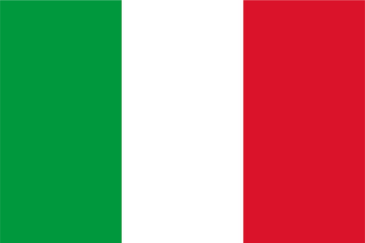

```{r setup, include=FALSE}
library(flexdashboard)
library(dplyr)
library(shiny)
library(scales)
## maps ##
library(leaflet)
library(leaflet.extras)
library(sf)
# library(stars)
library(viridis)
#


if(basename(getwd()) == "dashboard"){pl = "../"}else{pl = ""}
```

```{js, echo=FALSE}
$(document).ready(function() {
  $('#dashboard-container').on('flexdashboard:layoutcomplete', function() {
    $('.navbar-right').prepend('<div class="dark-theme-toggler"><div class="toggle "><div class="toggle-track"><div class="toggle-track-check"></div> <div class="toggle-track-x"></div></div> <div class="toggle-thumb"></div></div> <input type="checkbox" aria-label="Switch between Dark and Default theme" class="toggler-screen-reader-only"></div>');
  });
})
window.addEventListener("load", (event) => {
    const toggler = document.querySelector(".dark-theme-toggler .toggle");
    toggle_style_additional(toggler);
    toggler.addEventListener("click", (event) => {
        toggler.classList.toggle("checked");
        toggle_style_additional(toggler);
    })
});
// Additional styles for dark mode
  function set_light_style_additional() {
    const style = document.documentElement.style;
    style.setProperty('--main-background', '#f7f7f7');
    style.setProperty('--background-alt-color', 'white');
    style.setProperty('--text-color', '#000');
    style.setProperty('--border-color', '#e6e6e6');
    style.setProperty('--border-color', '#e6e6e6');
    style.setProperty('--dark-map-filter', 'none');
}
function set_dark_style_additional() {
    const style = document.documentElement.style;
    style.setProperty('--main-background', '#2f3136');
    style.setProperty('--background-alt-color', '#373c49');
    style.setProperty('--text-color', '#ffffffe0');
    style.setProperty('--border-color', '#888888');
    style.setProperty('--dark-map-filter', 'brightness(0.6) invert(1) contrast(3) hue-rotate(0deg) saturate(0.3) brightness(0.8)  sepia(100%) hue-rotate(190deg)');
}

// Apply CSS variables defined above
function toggle_style_additional(toggler) {
    if (toggler.classList.contains("checked")) {
        set_dark_style_additional();
    } else {
        set_light_style_additional();
    }
}
```

```{r map-data}
votazione = "politiche"
sezioni = readRDS(paste0(pl, "data/polygons/affluenza/sezioni_list.rds"))[[votazione]]
raster = readRDS(paste0(pl, "data/polygons/affluenza/raster_list.rds"))[[votazione]]
contour = readRDS(paste0(pl, "data/polygons/affluenza/contour_list.rds"))[[votazione]]
centroids = readRDS(paste0(pl, "data/polygons/affluenza/centroids_list.rds"))[[votazione]]
hexagon = readRDS(paste0(pl, "data/polygons/affluenza/hexagon_list.rds"))[[votazione]]
```

 Politiche 2022
================================================================================

### Mappa {data-width=600}
```{r main-2022}
viridis_option = "C"

affluenza_discrete = seq(floor(100*min(hexagon$affluenza)), 
                         ceiling(100*max(hexagon$affluenza)),
                         length = 8) %>% floor()/100

pal = colorNumeric(viridis_pal(option = viridis_option, direction = -1)(20),
                   range(affluenza_discrete))

legend_color = viridis_pal(option = viridis_option, direction = 1)(length(affluenza_discrete)-1)
legend_labels = paste0(label_percent()(affluenza_discrete)[-length(affluenza_discrete)], " - ",
                            label_percent()(affluenza_discrete)[-1]) %>% rev() 
legend_labels[1] = legend_labels[1] %>% gsub("-.*", "- Max", .)
legend_labels[length(legend_labels)] = legend_labels[length(legend_labels)] %>% gsub(".*-", "Min -", .)

centroids = centroids %>%
  mutate(affluenza_col = affluenza %>% ifelse(. <= min(affluenza_discrete), min(affluenza_discrete), .) %>%
           ifelse(. >= max(affluenza_discrete), max(affluenza_discrete), .))

contour = contour %>%
  mutate(affluenza_col = Max %>% ifelse(. <= min(affluenza_discrete), min(affluenza_discrete), .) %>% 
           ifelse(. >= max(affluenza_discrete), max(affluenza_discrete), .))

sezioni = sezioni %>%
  mutate(affluenza_col = affluenza %>% ifelse(. <= min(affluenza_discrete), min(affluenza_discrete), .) %>%
           ifelse(. >= max(affluenza_discrete), max(affluenza_discrete), .))

leaflet() %>%
  addProviderTiles("CartoDB.Positron",
                   options = providerTileOptions(minZoom = 12, maxZoom = 16, className = "dark-map-tiles")) %>%
  setView(lng = 11.3493292, lat = 44.492245, zoom = 12) %>%
  setMaxBounds(lng1 = 11.22814, lat1 = 44.41880, lng2 = 11.43364, lat2 = 44.55736) %>%
  addPolygons(data = hexagon, group = "Hexagon density",
              color = ~pal(affluenza), opacity = 0.5,
              fillColor = ~pal(affluenza), fillOpacity = 0.7,
              weight = 0.5, label  = ~affluenza_label) %>%
   addCircleMarkers(data = centroids, group = "Centroids sezioni",
                    color = ~pal(affluenza_col), radius = 8,
                    stroke = FALSE, fillOpacity = 0.5)  %>% hideGroup("Centroids sezioni") %>%
   addPolygons(data = contour, group = "Contour lines",
               weight = 0.5, opacity = 1, fillOpacity = 0.5,
               color = ~pal(affluenza_col), 
               smoothFactor = 0.1, label  = ~var1.pred, 
               highlight = highlightOptions(weight = 1, fillOpacity = 1, color = "white",
                                            bringToFront = TRUE,sendToBack = TRUE)) %>%
   addPolygons(data = sezioni, group = "Sezioni density",
               weight = 0.5, opacity = 1, fillOpacity = 0.5,
               color = ~pal(affluenza_col), 
               smoothFactor = 0.1, label  = ~affluenza_label, 
               highlight = highlightOptions(weight = 1, fillOpacity = 1, color = "white",
                                            bringToFront = TRUE,sendToBack = TRUE)) %>%
   addLayersControl(
     options = layersControlOptions(collapsed = FALSE),
     overlayGroups = c("Centroids sezioni"),
     baseGroups = c("Hexagon density", "Contour lines", "Sezioni density")
   ) %>%
   addLegend("bottomright",
             colors = legend_color,
             labels = legend_labels,
             opacity = 0.7, title = "Affluenza %")  %>%
   addResetMapButton()
```

### Sezioni {data-width=400}

 Comunali 2021
================================================================================


 Regionali 2020
================================================================================


 Europee 2019
================================================================================
